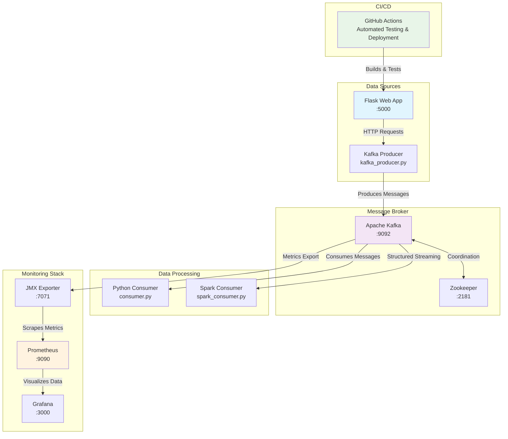
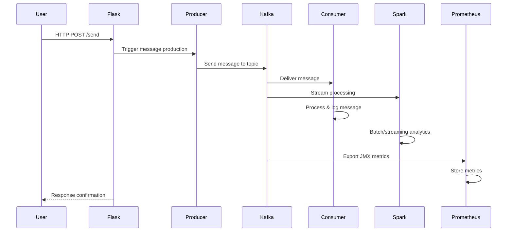

# Kafka Learning Platform with Flask, Spark & Monitoring

A comprehensive, dockerized learning environment for Apache Kafka with real-time monitoring and automated CI/CD workflows. This tutorial-based project helps you understand distributed streaming, data processing, and observability patterns.

## 🏗️ Architecture Overview



### Request Flow Diagram



## 📁 Project Structure

```
kafka-learning-platform/
├── README.md                           # This comprehensive guide
├── docker-compose.yml                  # Multi-service orchestration
├── docker-down-volumes-clean.sh        # Cleanup utility script
├── prometheus.yml                      # Prometheus configuration
├── app.py                             # Flask web application
├── kafka_producer.py                  # Kafka message producer
├── consumer.py                        # Simple Python consumer
├── spark_consumer.py                  # Spark streaming consumer
├── __pycache__/                       # Python cache files
├── templates/                         # Flask HTML templates
│   └── index.html                     # Web interface
├── jars/                             # Spark JAR dependencies
│   ├── kafka-clients-x.x.x.jar
│   └── spark-sql-kafka-x.x.x.jar
├── spark-conf/                       # Spark configuration files
│   ├── spark-defaults.conf
│   └── log4j.properties
├── .github/                          # GitHub Actions workflows
│   └── workflows/
│       ├── ci.yml                    # Continuous Integration
│       └── deploy.yml                # Deployment pipeline
├── tests/                            # Test suites
│   ├── test_producer.py
│   ├── test_consumer.py
│   └── test_flask_app.py
├── monitoring/                       # Grafana dashboards
│   └── dashboards/
│       ├── kafka-overview.json
│       └── application-metrics.json
└── docs/                            # Additional documentation
    ├── SETUP.md
    ├── TROUBLESHOOTING.md
    └── ARCHITECTURE.md
```

## 🚀 Quick Start Guide

### Prerequisites

- Docker & Docker Compose (v3.8+)
- Python 3.8+ (for local development)
- Git
- 8GB+ RAM recommended

### Installation Steps

#### 1. Clone the Repository

```bash
git clone https://github.com/yourusername/kafka-learning-platform.git
cd kafka-learning-platform
```

#### 2. Environment Setup

```bash
# Make cleanup script executable
chmod +x docker-down-volumes-clean.sh

# Create necessary directories (if not exists)
mkdir -p jars spark-conf templates tests monitoring/dashboards docs .github/workflows
```

#### 3. Start the Platform

```bash
# Start all services
docker-compose up -d

# Verify services are running
docker-compose ps

# View logs (optional)
docker-compose logs -f kafka flask-app
```

#### 4. Access the Services

| Service | URL | Description |
|---------|-----|-------------|
| Flask App | http://localhost:5000 | Web interface for sending messages |
| Kafka UI | http://localhost:8080 | Kafka cluster management |
| Prometheus | http://localhost:9090 | Metrics and monitoring |
| Grafana | http://localhost:3000 | Data visualization (admin/admin) |
| Spark UI | http://localhost:4040 | Spark job monitoring |

### 📸 Screenshot Placeholders

#### Web Interface
*[Screenshot: Flask web application interface showing message input form]*


#### Kafka Topics
*[Screenshot: Kafka UI showing topics and message flow]*


#### Prometheus Metrics
*[Screenshot: Prometheus metrics dashboard with Kafka JMX data]*


#### Grafana Visualization
*[Screenshot: Grafana dashboard showing real-time Kafka metrics]*


## 🛠️ Usage Examples

### Example 1: Basic Message Flow

```bash
# Send a test message via Flask API
curl -X POST http://localhost:5000/send \
  -H "Content-Type: application/json" \
  -d '{"message": "Hello Kafka!", "topic": "test-topic"}'

# Check consumer logs
docker-compose logs consumer

# View in Spark consumer
docker-compose logs spark-consumer
```

### Example 2: Custom Producer Script

```python
# custom_producer_example.py
from kafka_producer import send_message

# Send structured data
data = {
    "user_id": 12345,
    "event": "user_login",
    "timestamp": "2024-01-15T10:30:00Z",
    "metadata": {"ip": "192.168.1.1", "device": "mobile"}
}

send_message("user-events", data)
```

### Example 3: Monitoring Queries

```promql
# Prometheus queries for monitoring

# Kafka message rate
rate(kafka_server_brokertopicmetrics_messagesinpersec_count[5m])

# Consumer lag
kafka_consumer_lag_sum

# JVM memory usage
jvm_memory_used_bytes / jvm_memory_max_bytes * 100
```

## 🔧 Configuration & Customization

### Kafka Configuration

Edit `docker-compose.yml` to modify Kafka settings:

```yaml
environment:
  KAFKA_BROKER_ID: 1
  KAFKA_ZOOKEEPER_CONNECT: zookeeper:2181
  KAFKA_ADVERTISED_LISTENERS: PLAINTEXT://localhost:9092
  KAFKA_AUTO_CREATE_TOPICS_ENABLE: 'true'
  KAFKA_NUM_PARTITIONS: 3
  KAFKA_DEFAULT_REPLICATION_FACTOR: 1
```

### Spark Configuration

Modify `spark-conf/spark-defaults.conf`:

```properties
spark.master                     local[*]
spark.sql.streaming.checkpointLocation  /tmp/checkpoint
spark.sql.adaptive.enabled       true
spark.sql.adaptive.coalescePartitions.enabled  true
```

### Prometheus Configuration

Update `prometheus.yml` for custom scraping:

```yaml
scrape_configs:
  - job_name: 'kafka-jmx'
    static_configs:
      - targets: ['kafka:7071']
    scrape_interval: 10s
    
  - job_name: 'flask-app'
    static_configs:
      - targets: ['flask-app:5000']
    metrics_path: /metrics
```

## 🎯 Use Cases & Learning Scenarios

### 1. **Real-time Analytics Pipeline**
- **Scenario**: E-commerce clickstream analysis
- **Components**: Flask (web events) → Kafka → Spark (aggregations) → Dashboard
- **Learning**: Stream processing, windowing, stateful computations

### 2. **Microservices Communication**
- **Scenario**: Order processing system
- **Components**: Multiple Flask apps → Kafka topics → Specialized consumers
- **Learning**: Event-driven architecture, loose coupling, scalability

### 3. **IoT Data Processing**
- **Scenario**: Sensor data collection and alerting
- **Components**: Simulated sensors → Kafka → Real-time anomaly detection
- **Learning**: High-throughput ingestion, time-series analysis

### 4. **Log Aggregation & Monitoring**
- **Scenario**: Centralized logging system
- **Components**: Application logs → Kafka → ELK-style processing
- **Learning**: Log parsing, search indexing, observability

### 5. **Data Lake Ingestion**
- **Scenario**: Batch + streaming data warehouse
- **Components**: Multiple sources → Kafka → Spark → Parquet files
- **Learning**: Lambda architecture, data formats, ETL patterns

### 6. **A/B Testing Platform**
- **Scenario**: Feature flag and experiment tracking
- **Components**: Web app → Kafka → Real-time metric calculation
- **Learning**: Statistical analysis, real-time decision making

## 📋 TODO List

### ✅ Completed
- [x] Basic Kafka setup with Docker Compose
- [x] Flask web application for message sending
- [x] Python consumer implementation
- [x] Spark streaming consumer
- [x] Prometheus integration for monitoring

### 🔄 In Progress
- [ ] GitHub Actions CI/CD pipeline setup
- [ ] Comprehensive test suite implementation
- [ ] Grafana dashboard templates

### 📝 Planned Features

#### High Priority
- [ ] **Security Implementation**
  - [ ] Kafka SASL/SSL authentication
  - [ ] Flask JWT authentication
  - [ ] Network security policies

- [ ] **Enhanced Monitoring**
  - [ ] Custom application metrics
  - [ ] Alerting rules configuration
  - [ ] Performance benchmarking tools

- [ ] **Advanced Kafka Features**
  - [ ] Schema Registry integration
  - [ ] Kafka Connect connectors
  - [ ] Kafka Streams implementation

#### Medium Priority
- [ ] **Testing & Quality**
  - [ ] Integration test automation
  - [ ] Load testing scenarios
  - [ ] Code coverage reporting

- [ ] **Documentation**
  - [ ] API documentation with Swagger
  - [ ] Video tutorials
  - [ ] Troubleshooting guide

- [ ] **Development Tools**
  - [ ] Hot reloading for development
  - [ ] Debug configuration
  - [ ] IDE integration guides

#### Low Priority
- [ ] **Advanced Analytics**
  - [ ] Machine learning pipeline integration
  - [ ] Real-time recommendation engine
  - [ ] Predictive scaling

- [ ] **Infrastructure**
  - [ ] Kubernetes deployment manifests
  - [ ] Multi-environment configurations
  - [ ] Cloud provider templates (AWS, GCP, Azure)

- [ ] **UI/UX Improvements**
  - [ ] React-based frontend
  - [ ] Real-time data visualization
  - [ ] Mobile-responsive design

## 🔍 Monitoring & Observability

### Key Metrics to Watch

```promql
# Producer metrics
kafka_producer_record_send_rate
kafka_producer_request_latency_avg

# Consumer metrics  
kafka_consumer_records_consumed_rate
kafka_consumer_lag

# Broker metrics
kafka_server_brokertopicmetrics_bytesinpersec
kafka_server_brokertopicmetrics_bytesoutpersec

# Application metrics
flask_request_duration_seconds
spark_streaming_batch_processing_time
```

### Setting Up Alerts

Create alert rules in `prometheus/alerts.yml`:

```yaml
groups:
  - name: kafka_alerts
    rules:
      - alert: KafkaConsumerLag
        expr: kafka_consumer_lag > 1000
        for: 5m
        labels:
          severity: warning
        annotations:
          summary: "High consumer lag detected"
```

## 🧪 Testing

### Running Tests

```bash
# Unit tests
python -m pytest tests/ -v

# Integration tests
docker-compose -f docker-compose.test.yml up --build --abort-on-container-exit

# Load testing
docker run --rm -i loadimpact/k6 run - <load-test.js
```

### Test Categories

- **Unit Tests**: Individual component testing
- **Integration Tests**: Service interaction testing  
- **Performance Tests**: Load and stress testing
- **E2E Tests**: Complete workflow validation

## 🛠️ Development

### Local Development Setup

```bash
# Create virtual environment
python -m venv venv
source venv/bin/activate  # On Windows: venv\Scripts\activate

# Install dependencies
pip install -r requirements.txt

# Start only infrastructure services
docker-compose up -d kafka zookeeper prometheus

# Run Flask app locally
python app.py

# Run consumers locally
python consumer.py
python spark_consumer.py
```

### Code Modification Examples

#### Adding New Topics

```python
# In producer
def create_new_topic(topic_name):
    producer = KafkaProducer(
        bootstrap_servers=['localhost:9092'],
        value_serializer=lambda x: json.dumps(x).encode('utf-8')
    )
    # Topic will be auto-created on first message
    producer.send(topic_name, {'init': 'message'})
```

#### Custom Consumer Logic

```python
# In consumer.py
def process_message(message):
    data = json.loads(message.value.decode('utf-8'))
    
    # Add your custom processing logic here
    if data.get('event_type') == 'user_signup':
        handle_user_signup(data)
    elif data.get('event_type') == 'purchase':
        handle_purchase(data)
```

## 🚨 Troubleshooting

### Common Issues

1. **Kafka Connection Refused**
   ```bash
   # Check if Kafka is running
   docker-compose ps kafka
   
   # Restart Kafka service
   docker-compose restart kafka
   ```

2. **Out of Memory Errors**
   ```bash
   # Increase Docker memory allocation
   # Or reduce Spark parallelism in spark-defaults.conf
   spark.executor.memory=1g
   spark.driver.memory=1g
   ```

3. **Port Conflicts**
   ```bash
   # Check port usage
   netstat -tulpn | grep :9092
   
   # Modify ports in docker-compose.yml
   ```

### Cleanup

```bash
# Stop all services and clean up
./docker-down-volumes-clean.sh

# Or manually
docker-compose down -v
docker system prune -f
```

## 🤝 Contributing

1. Fork the repository
2. Create a feature branch (`git checkout -b feature/amazing-feature`)
3. Commit changes (`git commit -m 'Add amazing feature'`)
4. Push to branch (`git push origin feature/amazing-feature`)
5. Open a Pull Request

### Development Guidelines

- Follow PEP 8 for Python code
- Add tests for new features
- Update documentation
- Ensure all services start successfully

## 📚 Additional Resources

- [Apache Kafka Documentation](https://kafka.apache.org/documentation/)
- [Apache Spark Structured Streaming](https://spark.apache.org/docs/latest/structured-streaming-programming-guide.html)
- [Prometheus Monitoring](https://prometheus.io/docs/)
- [Docker Compose Reference](https://docs.docker.com/compose/)

## 📄 License

This project is licensed under the MIT License - see the [LICENSE](LICENSE) file for details.

---

**Happy Learning! 🎉**

*This platform is designed for educational purposes. For production deployments, additional security, monitoring, and scalability considerations are required.*
